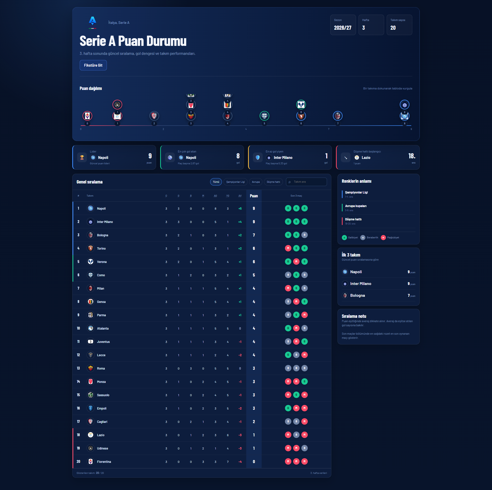
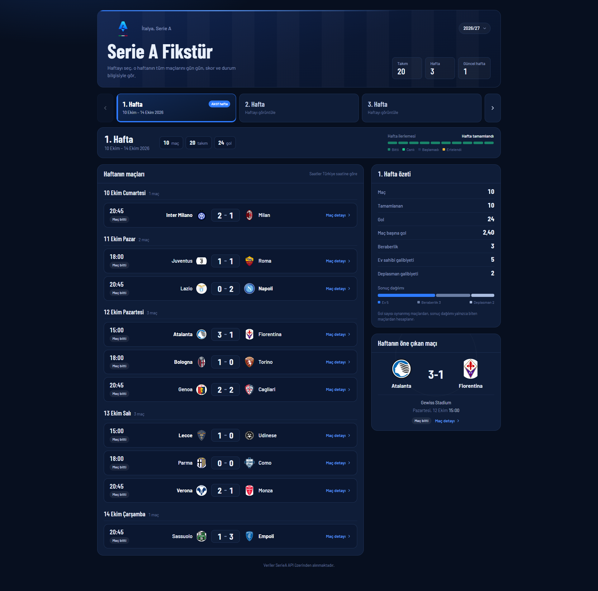
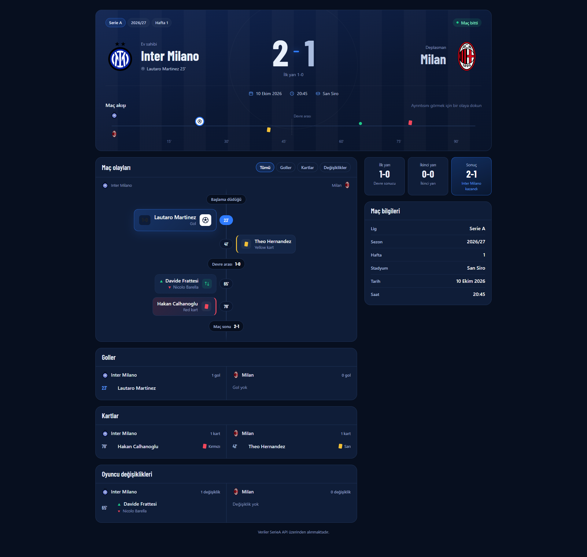
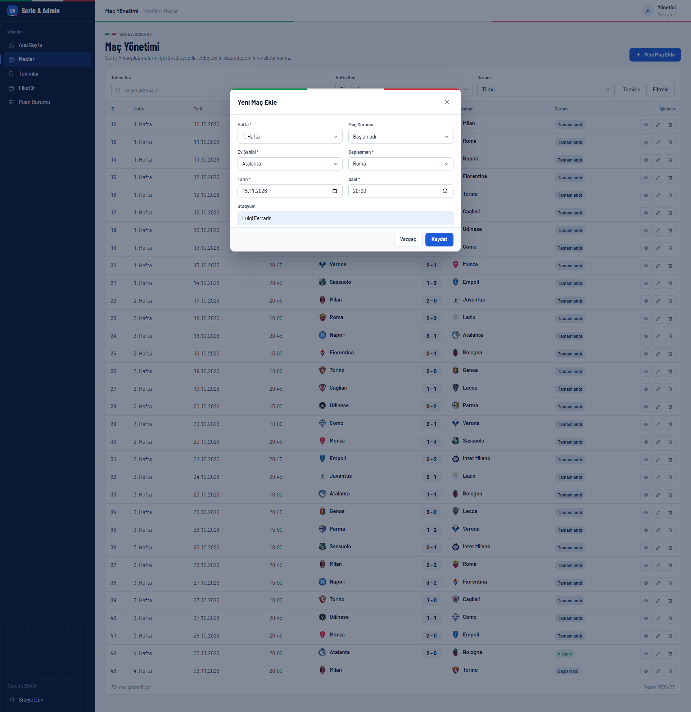
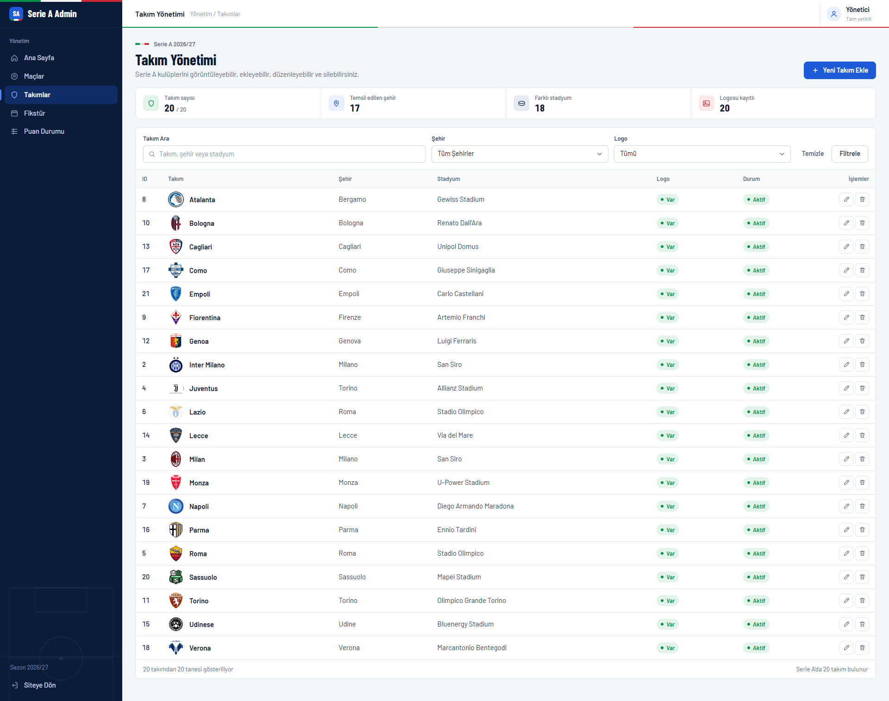

# Serie A Football App

ASP.NET Core Web API ve ASP.NET Core MVC kullanılarak geliştirilen, Serie A ligi için hazırlanmış full-stack futbol uygulaması.

Uygulamada puan durumu, haftalık fikstür, maç detayları ve admin paneli üzerinden maç/takım yönetimi bulunmaktadır. WebUI veritabanına doğrudan erişmez; tüm veriler API üzerinden tüketilir.

## Özellikler

- 20 Serie A takımı
- 38 haftaya uygun fikstür navigasyonu
- Haftaya göre maç listeleme
- Dinamik puan durumu
- Maç detay ekranı
  - skor
  - gol dakikaları
  - kartlar
  - oyuncu değişiklikleri
- Admin maç yönetimi
  - listeleme
  - ekleme
  - güncelleme
  - silme
- Admin takım yönetimi
  - listeleme
  - ekleme
  - güncelleme
  - silme
- Takım logoları
- Responsive arayüz
- SQL Server + Entity Framework Core
- REST API tüketen MVC WebUI

## Kullanılan Teknolojiler

### Backend
- C#
- ASP.NET Core Web API (.NET 8)
- Entity Framework Core
- SQL Server
- Swagger / OpenAPI

### Frontend
- ASP.NET Core MVC (.NET 8)
- Razor Views
- Bootstrap
- HTML5
- CSS3
- JavaScript

## Proje Yapısı

```text
SerieA
├── SerieA.API
│   ├── Context
│   ├── Controllers
│   ├── Entities
│   └── Data
│
└── SerieA.WebUI
    ├── Controllers
    ├── ViewModels
    ├── Views
    └── wwwroot
```

## Ekran Görüntüleri

### Puan Durumu


### Fikstür


### Maç Detayı


### Admin - Maç Yönetimi


### Admin - Takım Yönetimi


## API Endpointleri

### Takımlar

```http
GET    /api/Teams
GET    /api/Teams/{id}
POST   /api/Teams
PUT    /api/Teams/{id}
DELETE /api/Teams/{id}
```

### Maçlar

```http
GET    /api/Matches
GET    /api/Matches/{id}
GET    /api/Matches/week/{week}
POST   /api/Matches
PUT    /api/Matches/{id}
DELETE /api/Matches/{id}
```

### Puan Durumu

```http
GET /api/Standings
```

## Puan Durumu Kuralları

- Galibiyet: 3 puan
- Beraberlik: 1 puan
- Mağlubiyet: 0 puan
- Sadece `Finished` durumundaki maçlar puan durumuna dahil edilir.
- Averaj = Atılan Gol - Yenilen Gol
- Sıralama:
  1. Puan
  2. Averaj
  3. Atılan Gol

## İş Kuralları

- Ev sahibi ve deplasman takımı aynı olamaz.
- Bir takım aynı hafta içerisinde birden fazla maçta yer alamaz.
- Gol, kart ve oyuncu değişikliği kayıtları geçerli bir maça bağlıdır.
- Bulunamayan kayıtlar için uygun HTTP cevapları döndürülür.

## Kurulum

### 1. Repoyu klonlayın

```bash
git clone <repository-url>
cd SerieA
```

### 2. Connection String

`SerieA.API/appsettings.json` içindeki connection string'i kendi SQL Server ortamınıza göre düzenleyin.

Örnek LocalDB:

```json
"ConnectionStrings": {
  "DefaultConnection": "Server=(localdb)\\MSSQLLocalDB;Database=SerieADb;Trusted_Connection=True;TrustServerCertificate=True;"
}
```

> Gerçek kullanıcı adı, parola veya production connection string bilgilerini GitHub'a göndermeyin.

### 3. Veritabanını oluşturun

Package Manager Console veya terminal üzerinden migration'ları uygulayın.

```bash
dotnet ef database update --project SerieA.API
```

### 4. API'yi çalıştırın

```bash
dotnet run --project SerieA.API
```

Geliştirme ortamında API örnek olarak:

```text
https://localhost:7126
```

adresinde çalışabilir.

### 5. WebUI'yi çalıştırın

```bash
dotnet run --project SerieA.WebUI
```

Geliştirme ortamında WebUI örnek olarak:

```text
https://localhost:7170
```

adresinde çalışabilir.

> Portlar `launchSettings.json` ayarlarına göre değişebilir.

## Örnek Sayfalar

```text
/Standings
/Fixtures
/Match/Detail/{id}
/AdminMatch
/AdminTeam
```

## Demo Veri

Projede test amacıyla:

- 20 takım
- en az 3 haftalık fikstür
- haftada 10 maç
- en az 30 maç
- en az 3 detaylı maç

bulunmaktadır.

## Geliştirici

**İbrahim Kaan Dalgar**

GitHub: [Kaandalgar](https://github.com/Kaandalgar)

---

Bu proje bir ASP.NET Core Web API + MVC bootcamp case çalışması kapsamında geliştirilmiştir.
